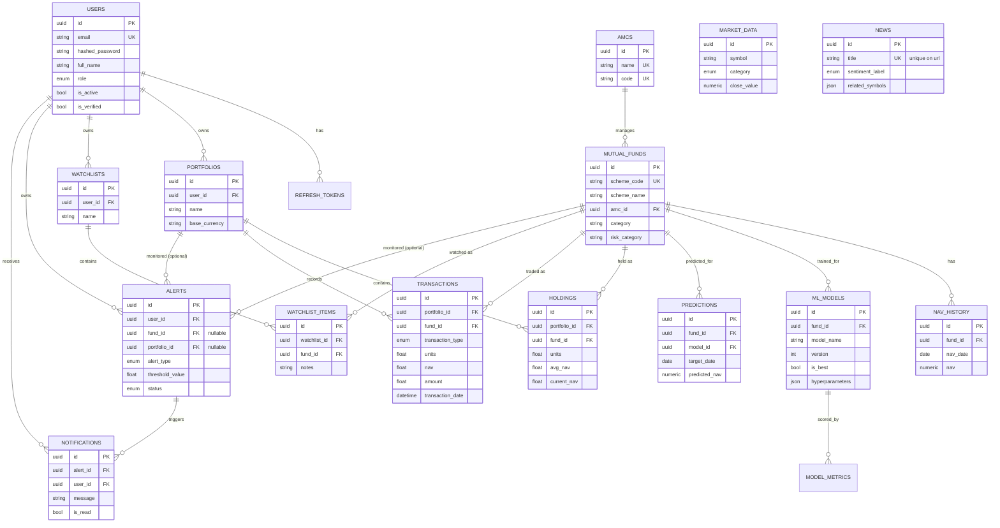

# Entity-Relationship Diagram

## Notes

- All primary keys are UUIDv4, generated application-side (`uuid.uuid4()` default on
  `mapped_column`), not database-side — this keeps IDs generatable before an INSERT is flushed
  (useful for the transaction/holding upsert flow in `PortfolioService`).
- `holdings` and `watchlist_items` each carry a `UNIQUE(portfolio_id/watchlist_id, fund_id)`
  constraint — a fund can only appear once per portfolio/watchlist; repeated purchases update
  the existing `Holding` row's weighted-average NAV rather than inserting a new row.
- `alerts.fund_id` and `alerts.portfolio_id` are both nullable and mutually-optional-but-not-
  exclusive at the DB level — the API layer (`AlertCreate` schema) is what decides which
  combination is meaningful for a given `alert_type`.
- See `alembic/versions/0004_portfolio_watchlist_alerts.py` for the exact column-level DDL,
  including all `ON DELETE` behaviors (`CASCADE` for user/portfolio/watchlist-owned rows,
  `RESTRICT` for `fund_id` on `holdings`/`transactions` so a fund can't be deleted out from
  under an existing position).
